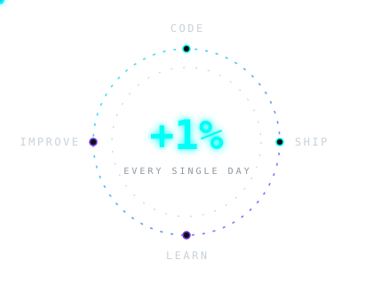

<!-- ═══════════════════ HEADER ═══════════════════ -->

<!-- ANIMATED TYPING -->

 

<!-- SOCIAL BADGES -->

<!-- DIVIDER -->

<!-- ═══════════════════ ABOUT ═══════════════════ -->
## 👨‍💻 About Me

 

<table>
<tr>
<td width="55%" valign="middle">

 

I enjoy turning ideas into real products — building scalable backends and modern, polished web apps with **ASP.NET Core** and **Angular**.

My whole approach fits in one sentence: ship something, learn from it, come back **1% better** — every single day.

 

</td>
<td width="45%" align="center" valign="middle">

</td>
</tr>
</table>

<!-- QUICK STATS -->

<!-- DIVIDER -->

<!-- ═══════════════════ TECH STACK ═══════════════════ -->
##  &nbsp; Tech Stack

 

| 🔵 Domain | 🛠️ Technologies |
|---|---|
| **Backend** | C# · ASP.NET Core · Web API · REST · SignalR · Python · Sanic |
| **Frontend** | Angular · React · TypeScript · JavaScript · HTML5 · CSS3 · Tailwind CSS · Bootstrap |
| **Database** | SQL Server · MySQL · MongoDB · Redis · Elasticsearch · Entity Framework Core |
| **Architecture** | Onion · Clean · N-Tier · Microservices · CQRS (MediatR) · Repository · Unit of Work |
| **Security** | JWT · OAuth2 · ASP.NET Core Identity · bcrypt · AES |
| **AI & ML** | OpenAI · Claude AI · Google Gemini · ML.NET · HuggingFace · ElevenLabs · Tavily |
| **DevOps & Tools** | Docker · Git · GitHub · Swagger · Postman |

 

 

<!-- DIVIDER -->

<!-- ═══════════════════ FEATURED PROJECTS ═══════════════════ -->
## 🚀 Featured Projects

<table>
<tr>
<td width="50%" align="center">

 🎧 <b>Music streaming platform</b> — playlists & ML.NET-powered personalized recommendations ASP.NET Core 8 · Angular 19 · Clean Architecture · CQRS · Redis · Elasticsearch · Docker
</td>
<td width="50%" align="center">

 🏗️ <b>Corporate web application</b> — content managed from admin panel with zero code changes ASP.NET Core 8 · Clean Architecture · CQRS · EF Core · SQL Server · JWT · IMemoryCache
</td>
</tr>
<tr>
<td colspan="2" align="center">

 📬 <b>AI-powered email platform</b> (graduation project) — Gmail & Outlook unified, automated AI replies & translation Python (Sanic) · React (TypeScript) · MySQL · OAuth2 · JWT · OpenAI API
</td>
</tr>
</table>

➕ More projects at <a href="https://github.com/AykutAdm?tab=repositories">github.com/AykutAdm</a> — 25+ repos and counting

<!-- DIVIDER -->

<!-- ═══════════════════ EXPERIENCE & EDUCATION ═══════════════════ -->
## 💼 Experience & Education

**🏢 Nanodems Software Company** — `Full Stack Development Intern`
📅 Aug 2024 &nbsp;|&nbsp; 📍 Ankara, Türkiye

> ✦ Built RESTful APIs with **ASP.NET Core**, **C#**, and **SQL Server** for an account management system
>  ✦ Applied **N-Tier Architecture** for scalability and clean separation of concerns
>  ✦ Developed responsive UI with **HTML**, **CSS**, **Bootstrap**, and **JavaScript**
>  ✦ Managed version control and team collaboration with **Git & GitHub**

 

**🏫 Turkish Aeronautical Association University** — `B.Sc. Computer Engineering`
📅 2020 – 2025 &nbsp;|&nbsp; 📍 Ankara, Türkiye &nbsp;|&nbsp; ⭐ GPA: **3.0 / 4.0**

**📚 M&Y Yazılım Akademi** — `Full Stack .NET Developer Bootcamp`
📅 Jan 2026 – Ongoing &nbsp;|&nbsp; 👨‍🏫 Instructor: **Murat Yücedağ**

**📜 AI & Machine Learning Certificate** — `Veri Analizi Okulu`
📅 2025 – 2026 &nbsp;|&nbsp; 🤝 In collaboration with YÖK, ODTÜ, İTÜ & Boğaziçi University

<!-- DIVIDER -->

<!-- ═══════════════════ GITHUB STATS ═══════════════════ -->
## 📊 GitHub Stats

 

<!-- DIVIDER -->

<!-- ═══════════════════ PAC-MAN ═══════════════════ -->
## 👾 Pac-Man Contribution Graph

<!--
  ⚠️ SETUP REQUIRED: Add .github/workflows/pacman.yml to THIS repo (AykutAdm/AykutAdm),
  run the workflow once from the Actions tab, and the URLs below will start working.
-->

<picture>
  <source media="(prefers-color-scheme: dark)" srcset="https://raw.githubusercontent.com/AykutAdm/AykutAdm/output/pacman-contribution-graph-dark.svg">
  <source media="(prefers-color-scheme: light)" srcset="https://raw.githubusercontent.com/AykutAdm/AykutAdm/output/pacman-contribution-graph.svg">
  
</picture>

🟡 Pac-Man is eating my commits — updated daily by GitHub Actions

<!-- DIVIDER -->

<!-- ═══════════════════ CONNECT ═══════════════════ -->
## 🔗 Let's Connect

&nbsp;

&nbsp;

  

 

<!-- FOOTER WAVE -->

